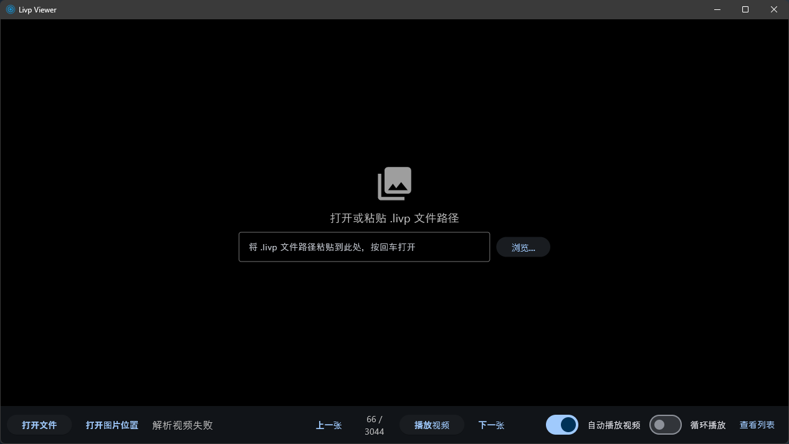

# Livp Viewer

Windows 桌面端 .livp (Live Photo) 文件查看器，可浏览静态图片并播放内嵌的动态视频。



## 功能

- 打开 .livp 文件，默认展示静态图片，可切换播放视频
- 自动扫描同目录下所有 .livp 文件，支持上一张/下一张切换
- **缩略图列表模式**：支持一键切换到缩略图网格视图，采用分页加载技术，即使处理上千张图片也能保持界面丝滑不卡顿
- **高性能缓存系统**：基于 SQLite 的缩略图缓存，二次加载瞬间完成
- 鼠标左键/空格：播放/暂停切换（图片模式下启动视频）
- 鼠标右键：切换全屏/窗口模式
- 非全屏时拖动媒体区域可移动窗口
- **系统托盘驻留**：关闭主窗口后自动最小化到系统托盘，右键托盘图标可快速唤醒或退出
- 单实例运行，双击 .livp 文件秒开（复用已运行实例）
- 点击文件名复制到剪贴板，支持自动/循环播放，设置自动保存

## 快速开始

需要 Python 3.12+，使用 [uv](https://docs.astral.sh/uv/) 管理依赖：

```bash
uv run main.py
```

开发模式（支持代码热重载，修改 `.py` 文件后应用将自动重新加载及重启，无需频繁手动启停）：

```bash
uv run dev.py
```

## 打包

### 本地打包

```bash
uv run flet build windows
```

构建产物在 `build/windows` 目录下。详细说明见 [HOW_TO_BUILD.md](HOW_TO_BUILD.md)。

### GitHub Actions 远程打包

仓库提供 Windows 打包流水线，构建完成后自动创建 GitHub Release：

1. 在 `pyproject.toml` 中更新版本号
2. 推送代码到 GitHub
3. 打开 Actions → build-windows → Run workflow
4. 构建完成后自动发布 Release 并附带打包好的 zip 文件

## 项目结构

| 文件/目录 | 说明 |
|-----------|------|
| `main.py` | 应用入口，单实例控制、后台 Socket 服务器 |
| `viewer.py` | 主界面 UI 逻辑、缩略图分页加载、系统托盘管理 |
| `parser.py` | .livp 文件协议解析、临时缓存管理、播放列表逻辑 |
| `thumbnail_cache.py` | 缩略图缓存中间层，负责存储与加载本地 SQLite 数据 |
| `config.py` | 用户配置持久化（INI 格式） |
| `dev.py` | 开发模式热重载脚本 |
| `livp_thumbnails.db` | 缩略图缓存仓库（自动生成，通过 .gitignore 忽略） |
| `assets/` | 软件图标等静态资源 |

## 技术栈

- [Flet](https://flet.dev/) — Python 跨平台桌面 UI 框架
- [flet-video](https://pub.dev/packages/flet_video) — 视频播放组件
- [SQLite](https://sqlite.org/) — 高效缩略图索引与存储
